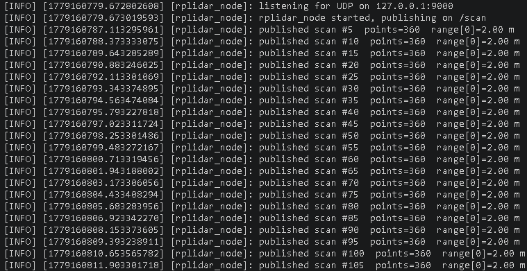

# lidar-udp-pipeline

A from-scratch RPLIDAR data pipeline in C++ and Python: a byte-faithful UDP
sensor stream, a dependency-free C++ parser library that decodes the RPLIDAR
wire format, an offline replay/verifier, and a thin ROS 2 node that
republishes the decoded scans as `sensor_msgs/LaserScan`.

The project is built around one principle: **replay must equal live**. The
same bytes flow through the same parser whether they come from a recorded
file or a live socket, and every decoded value is checked by hand against
known geometry rather than assumed correct.

## What it does

- **`sim/rplidar_sim.py`** — emits a synthetic RPLIDAR scan stream over UDP,
  byte-for-byte in the documented RPLIDAR 5-byte measurement format. It models
  a known room (a 4 m × 6 m rectangle with an 800 mm pillar) so every decoded
  distance has a value that can be checked against geometry.
- **`include/rplidar_parser.hpp` / `src/rplidar_parser.cpp`** — a standalone,
  ROS-free C++ library that turns a raw byte stream into structured scans. It
  tolerates partial and corrupt input: bad records are caught by their
  validity bits and the parser resynchronises rather than desyncing
  permanently.
- **`src/udp_capture.cpp`** — a protocol-agnostic UDP-to-file recorder. It
  knows nothing about RPLIDAR; it just preserves bytes, so a capture replays
  identically to the live stream.
- **`src/parse_file.cpp`** — an offline driver that runs the parser over a
  capture and reports scan count, the first measurement, and min/max range,
  for verification against the modelled geometry.
- **`ros2_ws/src/rplidar_ros/`** — a thin ROS 2 (Jazzy) node that reuses the
  parser **unchanged**, reads the live UDP stream, and publishes
  `sensor_msgs/LaserScan` on `/scan`.

## Architecture

The parser is a pure library with no ROS, no sockets, and no I/O of its own —
it consumes bytes and produces scans. The capture tool and the ROS 2 node are
thin adapters around it: one feeds it a file, the other feeds it a socket.
That is why the offline path and the live path are guaranteed to behave
identically, and why a real RPLIDAR (over a serial-to-UDP bridge) is a
drop-in byte-source swap with no parser changes.

Correctness is established by decoding, not by trust. With the simulator's
modelled room, the decoded stream is verified to show:

- ~2.00 m straight ahead (0°) — the near wall at 2000 mm,
- ~0.80 m across roughly 25°–35° — the modelled pillar,
- a maximum near 3.58 m around 57° — the far corner of the rectangle
  (√(2000² + 3000²) ≈ 3.6 m).

These values are read out of the live data and checked against the geometry
by hand.

## Build

C++ pipeline (plain CMake):

```bash
cmake -S . -B build
cmake --build build
```

ROS 2 node:

```bash
cd ros2_ws
source /opt/ros/jazzy/setup.bash
colcon build --packages-select rplidar_ros
source install/setup.bash
```

## Run

Start the simulated sensor (streams UDP to `127.0.0.1:9000`):

```bash
python3 sim/rplidar_sim.py
```

Offline path — record, then replay through the parser:

```bash
./build/udp_capture
./build/parse_file captures/scan.bin
```

Live path — the ROS 2 node, with the simulator running:

```bash
cd ros2_ws
source /opt/ros/jazzy/setup.bash
source install/setup.bash
ros2 run rplidar_ros rplidar_node
```

The node logs a throttled heartbeat as it publishes, e.g.
`published scan #50  points=360  range[0]=2.00 m`.



*The node running against the live simulator. Each heartbeat is a complete 360-point scan, and `range[0]` reads 2.00 m — the 2000 mm wall at 0°, matching the modelled room geometry. The parser producing this is the same source compiled, unchanged, into the offline tools.*

## Performance

The parser's buffering was written the simple, obviously-correct way first,
then optimised under measurement — not guesswork. `src/bench_parser.cpp`
replays a capture through the parser in the real small-chunk call pattern;
callgrind located the hotspots, wall-clock quantified them.

| Stage | Throughput | Instructions (callgrind) |
|---|---|---|
| Baseline | 200 MB/s | 163.1 M |
| Remove O(n) front-of-buffer erase | 220 MB/s | 90.1 M |
| Reserve the scan vector to known rotation size | 287 MB/s | 67.6 M |

Net: +43% throughput, -59% instructions, output bit-identical throughout
(216,000 scans, unchanged). Optimisation was deliberately stopped there: the
dominant remaining cost is the irreducible per-record decode itself, not a
fixable inefficiency.

## Status and limitations

- **The sensor is simulated, not physical.** The simulator is byte-faithful
  to the documented RPLIDAR wire format, and the architecture treats the
  device as an interchangeable byte source, but no physical RPLIDAR has been
  on the other end.
- **Cross-process ROS 2 introspection does not work under default WSL2
  networking.** `ros2 topic echo` and RViz rely on inter-process DDS
  discovery, which WSL2's network stack does not support even in mirrored
  mode (the Hyper-V firewall blocks DDS discovery traffic) — a documented
  WSL2 limitation, independent of this code. The node is verified directly
  via its own in-process scan logging. On native Linux it publishes standard
  `sensor_msgs/LaserScan` and is visualisable in RViz like any other laser
  source.

## Layout

```
sim/rplidar_sim.py          synthetic RPLIDAR UDP stream
src/udp_capture.cpp         protocol-agnostic UDP -> file recorder
src/rplidar_parser.cpp      parser library implementation
include/rplidar_parser.hpp  parser library public header
src/parse_file.cpp          offline replay / verifier
src/bench_parser.cpp        parser micro-benchmark harness
CMakeLists.txt              plain CMake build for the above
ros2_ws/src/rplidar_ros/    ROS 2 (Jazzy) node reusing the parser unchanged
captures/                   capture fixtures (binary, gitignored)